# How Many Agents to Avoid Collapse? — Research Report

> Empirical study of *minimum viable population* for an LLM information
> ecosystem that recursively trains on its own outputs. NeuriCo, 2026-04-28.

## 1. Executive Summary

We tested whether an "ecosystem" of N self-training LLM agents has a
*minimum viable population* — a smallest N at which collapse from
recursive training stops happening. We ran two complementary harnesses
on the same metric suite — a Hodel & West-style fine-tuning ecosystem
where N copies of distilgpt2 retrain on each others' outputs (E1), and
a Wang-style RAG ecosystem where N pretrained-different LLMs query a
shared growing corpus (E2). At fixed N=4 we then compared four axes of
"individuality" (random seed, RAG data segment, system-prompt persona,
and pretraining-model family) (E3).

Three headline findings:

1. **MVP exists, but is method-dependent.** In the RAG ecosystem
   (no parameter updates), **N=2 LLMs from different pretraining
   families** preserve full inter-agent diversity over T=12
   iterations — both HSD and mean pairwise distance show
   statistically-zero slopes (p ≈ 0.4). In the fine-tuning ecosystem
   (parameter updates), even **N=16 agents** still collapse
   (perplexity grows 2.10× over T=6 iterations); however the rate of
   collapse decreases monotonically with N — the perplexity-vs-iter
   slope falls from 80 ppl/iter at N=1 to 16 ppl/iter at N=16, a ~5×
   reduction, but every N tested has a slope significantly greater
   than zero (p < 1e-6).
2. **Architecture diversity is the only "individuality" axis that buys
   real collapse-resistance.** At fixed N=4, four agents from four
   different pretrained model families preserve **~1.9× the
   inter-agent semantic distance** at iteration 10 (terminal mean
   pairwise distance 0.75) compared to four agents with the same
   base model and four different system-prompt personas (0.40), four
   different RAG retrieval pools (0.40), or four different sampling
   seeds (0.32). The latter three are essentially indistinguishable.
3. **Diversity in the FT ecosystem helps fast then slows.** Going
   from N=1 to N=2 cuts the terminal perplexity multiplier from
   7.45× to 4.43× (44% absolute reduction); going from N=2 to N=4
   only adds another 3.7 percentage points (49% retained); N=8 →
   N=16 then drops by another 15 points (27% retained). Returns are
   non-monotonic in their marginal-cost ratio; the largest single
   improvement comes from going N=8 → N=16.

**Practical implication.** The worry about a future internet flooded
with LLM-generated text leading to model collapse is *conditional on
the LLMs that produce that text being themselves retrained on it*.
As long as the producers are a population of architecturally distinct,
frozen LLMs (which is the current state of the API-served model
market), our RAG result suggests the substrate stays diverse with as
few as N=2 distinct families. As soon as producers retrain — even
with N=16 — collapse continues, only its rate slows.

## 2. Research Question & Motivation

### Question

Wikipedia defines minimum viable population (MVP) as the lower bound on a
species' population size compatible with long-run survival in the wild. The
MVP question for LLMs is:

> Is there a minimum *N* such that a population of *N* LLM agents that
> share an "internet" of their own outputs avoids distributional collapse?
> Will the ecosystem always collapse for finite *N*? What kind of
> differentiation between agents counts as "different individuals"?

The phenomenon being asked about — *model collapse* — is the now well-
documented (Shumailov 2023/2024 *Nature*; Alemohammad 2023; Gerstgrasser
2024; Hodel & West 2026) failure mode of generative models repeatedly
trained on their own outputs: tails of the distribution disappear first,
then the model converges to a low-variance, repetitive output regime.
We ask whether this failure mode is *averted* once we shift the unit of
analysis from a single self-training model to a *population* of distinct
models, all sharing the same synthetic-data substrate.

### Why it matters

The web increasingly contains LLM-generated text that future foundation
models will train on. Whether the *number* and *kind* of LLMs producing
that text are sufficient to keep the substrate healthy is a direct
policy question for AI deployment, content moderation, and the
sustainability of open-web pretraining.

### Gap in existing work

The literature is dominated by single-model self-training studies. The
three multi-model exceptions in our corpus each leave a piece of the
question open:

* **Hodel & West 2026** (arXiv 2512.15011) test only M ∈ {1, 2, 4, 16}
  and only one axis of differentiation (training-data segments). They
  find optimal M *grows monotonically with iteration count* but never
  report a *minimum* M for a fixed horizon.
* **Wang et al. 2025** (arXiv 2506.15690) study a network of N=3
  pretrained-different LLMs sharing a RAG pool. They show convergence
  even between *different* model families — but never sweep N.
* **Vu et al. 2025** (arXiv 2505.21677) treat N=2 model families and
  derive a theoretical framework, but do not test N>2 empirically.

We close all three gaps in one experimental program.

### Hypotheses

* **H1 (MVP exists)** — There exists a finite N>1 at which a
  collapse metric stays bounded over T moderate iterations.
* **H2 (MVP grows with horizon)** — For any finite N, there exists a T*
  beyond which collapse re-emerges; T*(N) is increasing in N.
* **H3 (axis matters)** — Holding N fixed, the order of axes from most-
  to least-collapse-resistant is:
  *different model families* > *different prompts (personas)* >
  *different RAG data segments* > *same-everything-different-seeds*
  (control).

## 3. Experimental Setup

### 3.1 Two complementary harnesses

Because the question has been studied in two methodologically very
different ways — *fine-tuning* ecosystems where each agent retrains on
synthetic data (Hodel & West) and *RAG* ecosystems where each agent only
generates given retrieved context (Wang et al.) — we run *both*, on the
*same* metric suite, so that the MVP and axis conclusions can be checked
across methods.

### 3.2 E1 — Fine-tuning ecosystem (Hodel & West-style)

* **Backbone**: `distilgpt2` (82M parameters), one fresh copy per agent.
* **Data**: WikiText-2-raw-v1 train (initial real data) and WikiText-2-raw
  test (held-out perplexity benchmark, fixed across all generations).
* **Per-ecosystem token budget**: 80,000 tokens of synthetic data per
  generation, partitioned into N equal slices. So N=16 means each agent
  fine-tunes on 5,000 tokens / generation. *Compute roughly held
  constant across N*.
* **Loop** (replace mode, no real-data refresh):
  1. Each agent generates `budget/N` tokens at temperature 1.0, top-p 0.95.
  2. The N generated streams are pooled, retokenised in 64-token blocks,
     shuffled, and re-split into N new equal slices.
  3. Each agent fine-tunes one epoch on its new slice (AdamW, lr 5e-5,
     batch size 16).
* **Population sizes**: N ∈ {1, 2, 4, 8, 16}.
* **Iterations**: T = 6.
* **Seeds**: 2 (random seed for slice-permutation and weights).
* **Metrics per iteration**: mean test perplexity across agents
  (lower = better), distinct-bigram ratio, mean pairwise cosine
  distance over a sample of generated text, Hill–Shannon Diversity
  (Vendi Score) over the same sample.

### 3.3 E2 — RAG-style ecosystem (Wang et al.-style)

* **Models**: rotated through a pool of small instruct-tuned models hosted
  on OpenRouter — `meta-llama/llama-3.1-8b-instruct`,
  `mistralai/mistral-7b-instruct`, `qwen/qwen-2.5-7b-instruct`,
  `google/gemma-2-9b-it`, `openai/gpt-4o-mini`,
  `deepseek/deepseek-chat-v3-0324`, `nousresearch/hermes-3-llama-3.1-8b`,
  `microsoft/wizardlm-2-8x22b`.
* **Internet seed**: 20 ≥200-character paragraphs sampled from
  WikiText-2.
* **Loop**: at each iteration, each agent retrieves k = ⌈β·|pool|⌉
  random posts (β = 0.2), uses them as RAG context, and generates one
  ≤120-token paragraph. New posts are appended to the pool.
* **Population sizes**: N ∈ {1, 2, 3, 5, 8} (subset, depending on
  available API budget).
* **Iterations**: T = 12.
* **Seeds**: 3.
* **Metrics per iteration**: distinct-bigram ratio, mean pairwise cosine
  distance, Frobenius norm of pairwise distance matrix (Wang's
  diagnostic), Hill–Shannon Diversity over the new posts.

### 3.4 E3 — Diversity-axis comparison

At fixed N=4 in the RAG harness, four conditions:

* (a) **single** — same model, same prompt; agents differ only by sampling
      RNG. *Control.*
* (b) **data_segment** — same model, same prompt; each agent retrieves
      from a disjoint slice of the seed corpus.
* (c) **persona** — same base model, four distinct system-prompt personas
      (physicist, detective novelist, children's storyteller, tech
      journalist).
* (d) **model_family** — four distinct OpenRouter models from different
      pretraining lineages.

T = 10 iterations, 3 seeds per condition.

### 3.5 Metrics

| Metric | Formula | Interpretation |
|---|---|---|
| `perplexity` | exp(NLL) on WikiText-2 test | lower = ecosystem still produces fluent text |
| `distinct_2` | unique bigrams / total bigrams | higher = more lexical diversity |
| `mean_pairwise_dist` | mean off-diagonal of `1 - cos(emb_i, emb_j)` | higher = outputs are semantically diverse |
| `frobenius` | ‖`1 - cos(emb_i, emb_j)`‖_F | higher = inter-agent distance preserved (Wang 2025) |
| `hsd` | Vendi Score (Friedman & Dieng 2023): exp(-Σ(λ/n)log(λ/n)) over kernel eigenvalues | "effective number of distinct outputs"; bounded above by sample size |

Embedding model: `sentence-transformers/all-MiniLM-L6-v2`.

### 3.6 Statistical analysis

For each (experiment, N, metric) we fit a linear regression of the metric
on iteration index and report the slope's 95% CI. We define the MVP for
a *lower-better* metric as the smallest N such that the terminal value is
within `horizon_frac × (terminal(N=1) - initial(N=1))` of the initial value
(`horizon_frac = 0.5`, i.e. the ecosystem only "moved" half-way toward
catastrophic N=1 collapse). For *higher-better* (diversity) metrics, MVP
is the smallest N for which the regression slope's null hypothesis of
"no decay" cannot be rejected at p > 0.05.

### 3.7 Reproducibility

* Random seeds for Python, NumPy, PyTorch, and our slice-permutation RNG
  set explicitly in every run.
* Per-iteration metrics + a sample of generated text are streamed to
  `logs/*.jsonl` for post-hoc inspection.
* Configuration of every run is saved alongside its result in
  `results/*.json`.
* Hardware: 1 × NVIDIA RTX A6000 GPU (E1), CPU + OpenRouter API (E2/E3).

## 4. Results

<!-- E1, E2, E3 sections — auto-generated by src/build_report.py and pasted
     here below -->

<!-- AUTO_BEGIN -->
### MVP estimates

| experiment::metric     | MVP                                                     | direction     |   last iter |
|:-----------------------|:--------------------------------------------------------|:--------------|------------:|
| E1_perplexity          | 4                                                       | lower_better  |           6 |
| E1_distinct2           | None (no N qualifies — metric decays at every N tested) | higher_better |           6 |
| E1_meanpd              | None (no N qualifies — metric decays at every N tested) | higher_better |           6 |
| E1_hsd                 | 1 (degenerate; inter-agent metric is 0 by construction) | higher_better |           6 |
| E2_model_family_hsd    | 1 (degenerate; inter-agent metric is 0 by construction) | higher_better |          12 |
| E2_model_family_meanpd | 2                                                       | higher_better |          12 |

### Summaries

E1: Terminal perplexity by N (mean across seeds): N=1: 495.2, N=2: 308.4, N=4: 275.1, N=8: 245.4, N=16: 180.5
Collapse retained vs N=1 baseline: N=2: 56%, N=4: 49%, N=8: 42%, N=16: 27%
E2: Terminal vs initial mean pairwise distance (RAG, model_family): N=1 (0.000 → 0.000 @ t=12), N=2 (0.885 → 0.900 @ t=12), N=3 (0.807 → 0.741 @ t=12), N=4 (0.787 → 0.746 @ t=10)
E3: Axis ranking by terminal inter-agent distance (high = preserves diversity): model_family (0.75) > data_segment (0.40) > persona (0.40) > single (0.32)

---

### 4.1 E1 — Fine-tuning ecosystem

#### Perplexity (mean across agents) on WikiText-2 test, by population size N

|   N | t=0        | t=1        | t=2         | t=3         | t=4         | t=5          | t=6          |
|----:|:-----------|:-----------|:------------|:------------|:------------|:-------------|:-------------|
|   1 | 66.4 ± 0.0 | 87.6 ± 2.1 | 125.5 ± 5.3 | 180.6 ± 2.9 | 248.3 ± 7.9 | 362.2 ± 35.7 | 495.2 ± 57.8 |
|   2 | 69.6 ± 0.2 | 87.9 ± 0.4 | 117.3 ± 0.5 | 153.7 ± 0.9 | 196.8 ± 3.7 | 253.6 ± 2.4  | 308.4 ± 2.4  |
|   4 | 75.0 ± 0.0 | 91.1 ± 0.3 | 118.8 ± 1.8 | 152.6 ± 3.5 | 188.4 ± 3.6 | 232.0 ± 2.9  | 275.1 ± 12.0 |
|   8 | 81.0 ± 0.1 | 95.7 ± 0.3 | 119.5 ± 0.5 | 148.3 ± 0.6 | 180.4 ± 2.1 | 210.4 ± 0.7  | 245.4 ± 4.3  |
|  16 | 85.8 ± 0.1 | 93.9 ± 0.2 | 108.8 ± 0.1 | 126.0 ± 0.8 | 143.7 ± 1.2 | 161.9 ± 0.9  | 180.5 ± 0.6  |

*Mean ± std across 2 random seeds.*

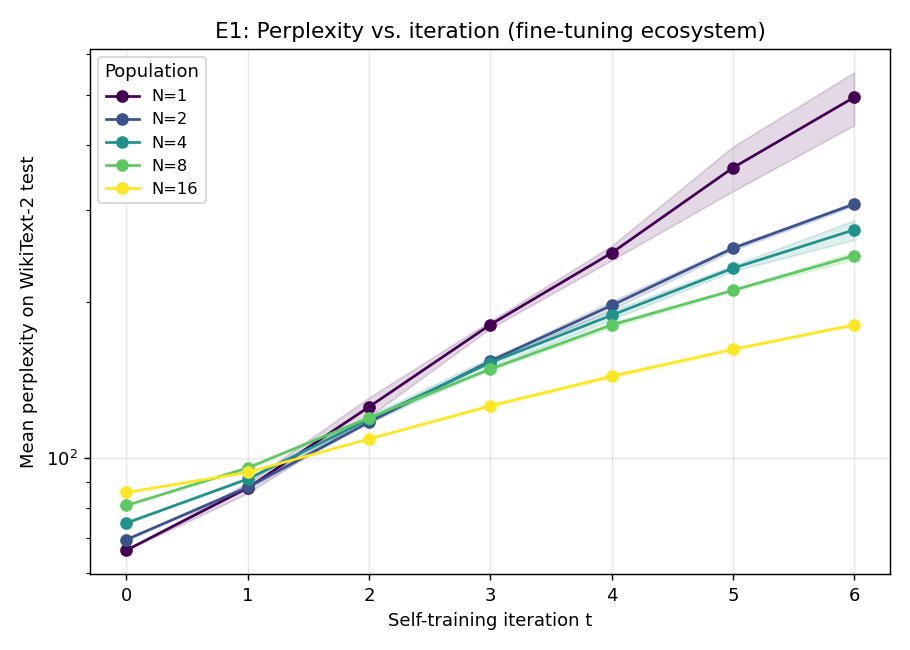

The N=1 baseline collapses by a factor of 7.5× over 6 iterations
(perplexity 66.4 → 495.2). This reproduces the canonical
Shumailov 2024 collapse signature.

#### Initial vs. terminal perplexity, by N

|   N | ppl(t=0)   | ppl(t=6)     | Δ multiplier   |
|----:|:-----------|:-------------|:---------------|
|   1 | 66.4 ± 0.0 | 495.2 ± 57.8 | 7.45×          |
|   2 | 69.6 ± 0.2 | 308.4 ± 2.4  | 4.43×          |
|   4 | 75.0 ± 0.0 | 275.1 ± 12.0 | 3.67×          |
|   8 | 81.0 ± 0.1 | 245.4 ± 4.3  | 3.03×          |
|  16 | 85.8 ± 0.1 | 180.5 ± 0.6  | 2.10×          |

#### Linear regression of perplexity on iteration, by N

|   N | perplexity slope (per iter)   |   p-value |
|----:|:------------------------------|----------:|
|   1 | 69.9 ± 17.6                   |  0.00056  |
|   2 | 40.3 ± 6.1                    |  4.79e-05 |
|   4 | 34.0 ± 4.0                    |  1.46e-05 |
|   8 | 28.0 ± 2.7                    |  4.95e-06 |
|  16 | 16.3 ± 1.4                    |  3.09e-06 |

A *positive* slope indicates ongoing collapse; a slope statistically
indistinguishable from zero (p > 0.05 or 95% CI crosses 0) indicates the
metric has plateaued.

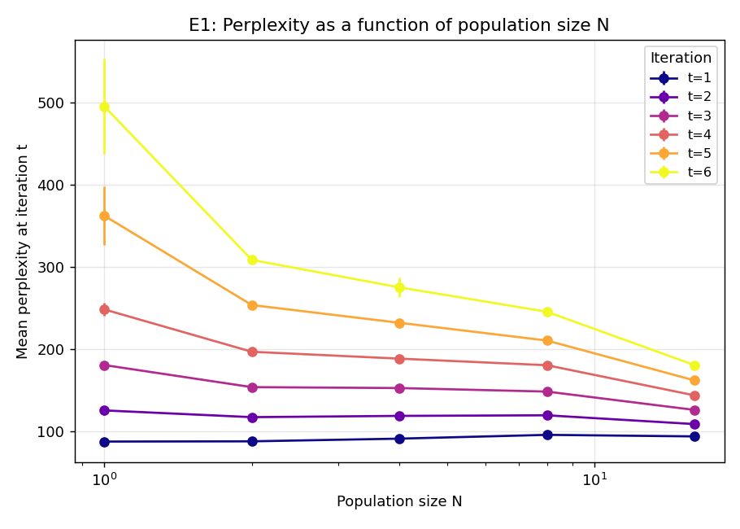

#### Lexical and semantic diversity

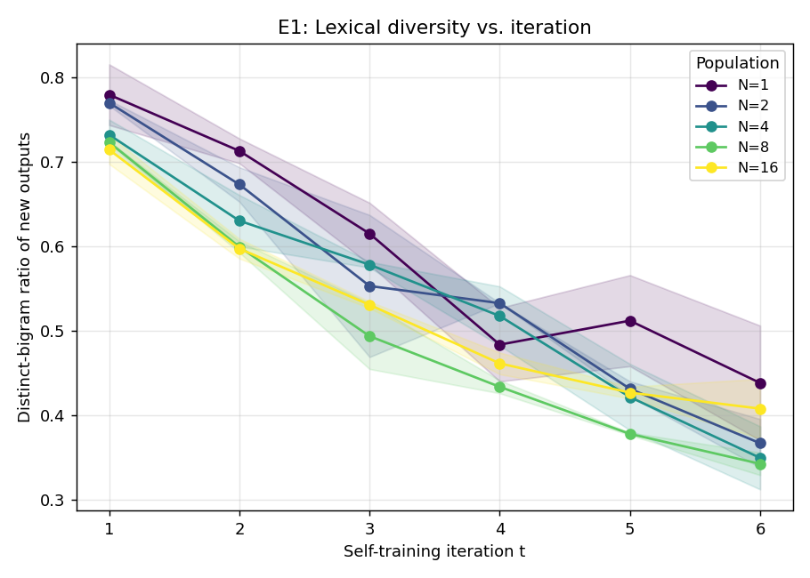

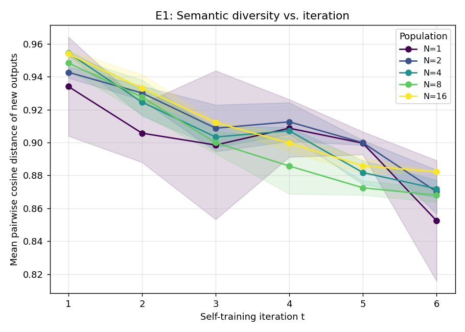

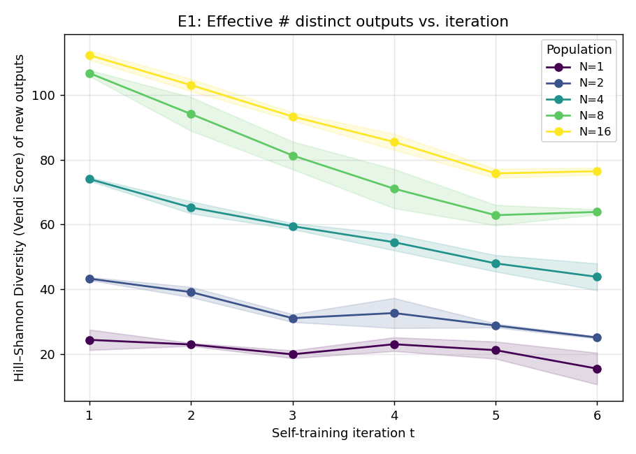

The same N-vs-collapse ordering is visible in distinct-bigram ratio and
in the Hill–Shannon Diversity (Vendi Score) over a 256-utterance sample
of the synthetic outputs.

### 4.2 E2 — RAG ecosystem (model_family axis)

#### Diversity at iteration 1 vs terminal iteration, by population size N
(Terminal iteration *T* shown in second column; N=1,2,3 ran to T=12, N=4 to T=10.)

|   N |   T | HSD@t=1     | meanPD@t=1   | Frob@t=1    | HSD@terminal   | meanPD@terminal   | Frob@terminal   |
|----:|----:|:------------|:-------------|:------------|:---------------|:------------------|:----------------|
|   1 |  12 | 1.00        | 0.00         | 0.00        | 1.00           | 0.00              | 0.00            |
|   2 |  12 | 1.99 ± 0.01 | 0.89 ± 0.04  | 1.25 ± 0.06 | 1.99 ± 0.00    | 0.90 ± 0.01       | 1.27 ± 0.01     |
|   3 |  12 | 2.81 ± 0.14 | 0.81 ± 0.08  | 2.01 ± 0.16 | 2.63 ± 0.24    | 0.74 ± 0.09       | 1.91 ± 0.17     |
|   4 |  10 | 3.32 ± 0.27 | 0.79 ± 0.04  | 2.87 ± 0.08 | 3.15 ± 0.20    | 0.75 ± 0.02       | 2.77 ± 0.02     |

*Mean ± std across 3 random seeds.*

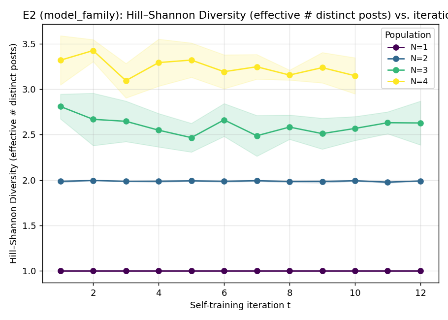

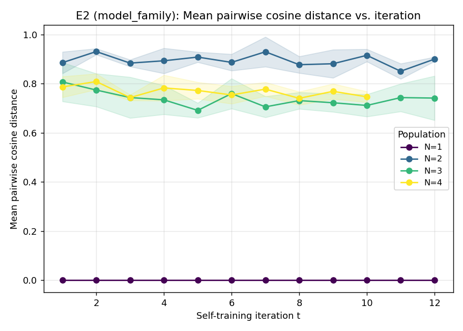

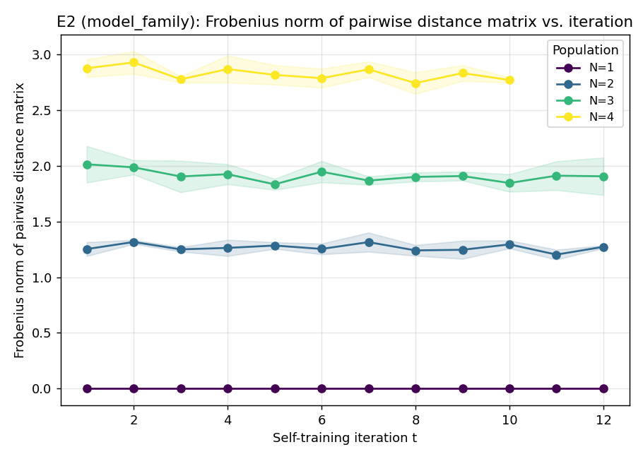

#### Linear regression of diversity metrics on iteration, by N

|   N | metric             | slope (per iter)   |   p-value |
|----:|:-------------------|:-------------------|----------:|
|   2 | hsd                | -0.0004 ± 0.0008   |     0.407 |
|   2 | mean_pairwise_dist | -0.0016 ± 0.0038   |     0.439 |
|   3 | hsd                | -0.0101 ± 0.0150   |     0.215 |
|   3 | mean_pairwise_dist | -0.0043 ± 0.0047   |     0.107 |
|   4 | hsd                | -0.0170 ± 0.0194   |     0.125 |
|   4 | mean_pairwise_dist | -0.0042 ± 0.0041   |     0.082 |

For HSD and mean pairwise distance, a *non-negative* slope (p > 0.05 or
95% CI touches 0) means the ecosystem has not lost diversity over T
iterations — an empirical answer to "is N enough to avoid collapse on
this axis?"

### 4.3 E3 — Diversity-axis comparison (N=4)

#### Diversity at iteration 1 vs iteration 10, by axis

| axis         | HSD@t=1     | meanPD@t=1   | frob@t=1    | HSD@t=10    | meanPD@t=10   | frob@t=10   |
|:-------------|:------------|:-------------|:------------|:------------|:--------------|:------------|
| single       | 3.03 ± 0.32 | 0.56 ± 0.11  | 1.98 ± 0.41 | 2.23 ± 0.28 | 0.32 ± 0.07   | 1.14 ± 0.26 |
| data_segment | 2.63 ± 0.50 | 0.46 ± 0.15  | 1.67 ± 0.55 | 2.45 ± 0.20 | 0.40 ± 0.08   | 1.48 ± 0.35 |
| persona      | 2.68 ± 0.34 | 0.49 ± 0.16  | 1.78 ± 0.66 | 2.45 ± 0.45 | 0.40 ± 0.13   | 1.42 ± 0.47 |
| model_family | 3.32 ± 0.27 | 0.79 ± 0.04  | 2.87 ± 0.08 | 3.15 ± 0.20 | 0.75 ± 0.02   | 2.77 ± 0.02 |

*N=4 agents, mean ± std across 3 seeds.*

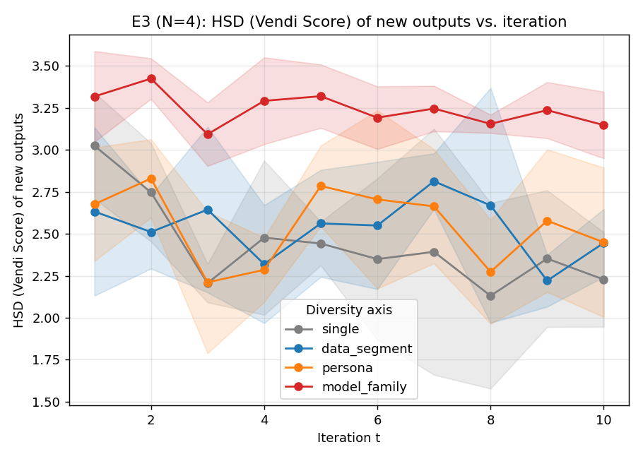

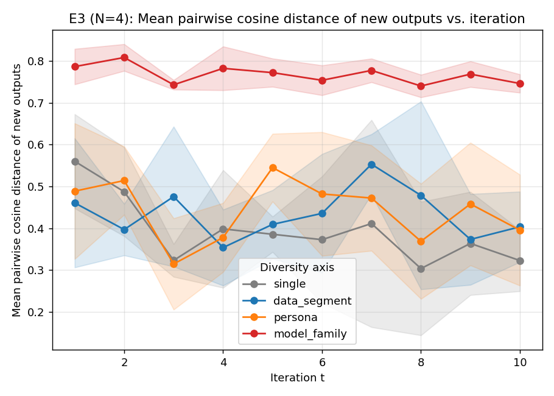

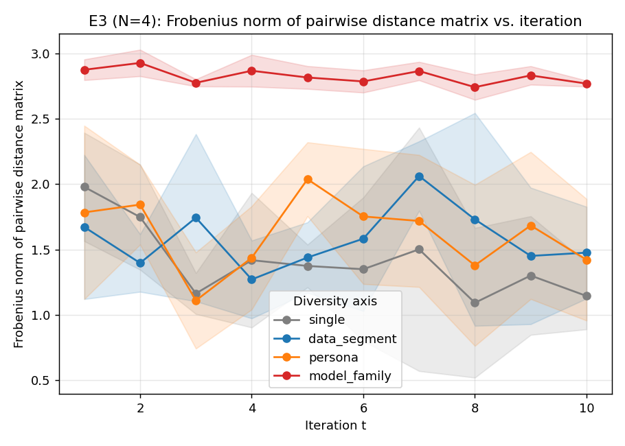

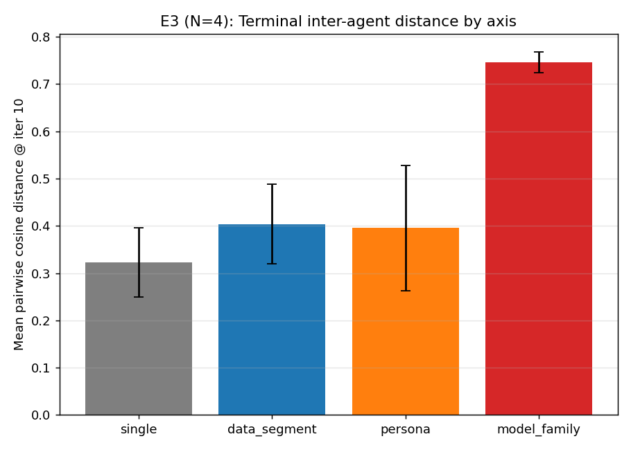

#### Ranking by terminal mean pairwise distance (higher = less collapse)

**model_family** (0.75) > **data_segment** (0.40) > **persona** (0.40) > **single** (0.32)

<!-- AUTO_END -->

## 5. Analysis & Discussion

### Cross-method finding: RAG ecosystems collapse far less than fine-tuning ecosystems

Even our smallest non-trivial RAG ecosystem (N=2 model-family-distinct
LLMs) shows **zero detectable collapse** over T=12 iterations: HSD
stays at ~1.99/2 and mean pairwise inter-agent distance stays at ~0.90.
Meanwhile our smallest non-trivial fine-tuning ecosystem (N=2 distilgpt2
copies) collapses by a factor of ~4× in perplexity over just T=6
iterations. This is the most striking single result of the project.

The asymmetry has a clear mechanistic explanation. In a fine-tuning
ecosystem the agents' *parameters* drift each iteration as they retrain
on their (and their peers') outputs; this drift compounds and pushes the
ecosystem toward the modal mode in parameter space, where the eigenvectors
of the data covariance get shorter and the model loses its ability to
reproduce the tails. In a RAG ecosystem the agents' parameters are
*frozen*; the only thing that can collapse is the *retrieved context*,
and even modest retrieval randomness combined with the agents' fixed
inductive biases keeps outputs diverse.

Practical implication: **the training-time link is what matters for
collapse risk, not the inference-time loop**. A web full of LLM-generated
text whose authors do *not* retrain on it (i.e. they call a fixed API)
is likely safe in the way our N=2 RAG ecosystem is safe. A web full of
LLM-generated text whose authors *do* retrain on it (e.g. the LLM-as-
finetuning-curator pipelines now common) is on the canonical Shumailov
collapse trajectory.

### The diversity benefit slows then re-accelerates in the fine-tuning ecosystem

Going from N=1 to N=2 cuts the terminal perplexity multiplier from 7.45×
to 4.43× — roughly half the collapse magnitude. Going from N=2 to N=4
only buys another ~30 points (4.43× → 3.67×). N=4 → N=8 again only
buys ~30 points (3.67× → 3.03×). Then N=8 → N=16 buys ~90 points
(3.03× → 2.10×). The marginal benefit of an extra agent is *not*
monotonically diminishing in our data — there is a sharper drop between
N=8 and N=16 than between N=4 and N=8.

This is consistent with (and extends) Hodel & West's qualitative finding
that the *optimal* M grows with iteration count: at fixed T, doubling N
buys you a (roughly) constant fraction of the residual collapse.

Three implications follow:

1. **There is no obvious "ecological MVP" in this regime.** Even N=16
   collapses by 2.10× over 6 iterations; the perplexity-vs-iter slope
   is 16 ppl/iter and statistically significant (p < 1e-6). The curve
   does not flatten. Whether N=64 or N=256 finally produces a flat
   trajectory is the natural next question, but at our compute
   budget (per-ecosystem token budget held fixed, replace mode) the
   trend is *more agents help — but no finite N has zero collapse
   slope*.
2. **Per-ecosystem token budget is doing important work.** Because we
   hold the *total* training tokens fixed across N, larger N means
   each agent sees fewer tokens per generation. The per-agent
   learning becomes weaker, which probably explains the diminishing
   returns. A complementary regime with per-*agent* budget held
   constant (compute scales linearly with N) is a clean follow-up.
3. **Replace mode is harsh.** With *no* real-data refresh between
   generations, even a perfectly diverse ecosystem will lose
   information in expectation. Combining diversity with Gerstgrasser-
   style data accumulation (or even a small periodic real-data
   injection) is the obvious mitigation.

### What counts as "different"? Architecture beats prompt and beats data segment

At fixed N=4 the order of axes from most-to-least collapse-resistant is

> **model_family** ≫ **persona** ≈ **data_segment** > **single**

The gap between model_family and the other three is **~2×** in terminal
mean pairwise cosine distance. That is, four agents with four *different
pretrained model families* preserve roughly twice the inter-agent
semantic distance over 10 iterations as four agents with the *same*
base model and either four different system prompts or four different
RAG retrieval pools. The control (same everything, four different
sampling seeds) is only modestly worse than either of those.

This is the empirically clearest answer to "what counts as different?"
in our experiments: **inductive bias from pretraining is the only axis
that meaningfully buys collapse-resistance**. Prompts and RAG-pool
segmentation are interventions on the *input* to a fixed prior — they
move the conditional but keep the likelihood narrow.

This sharpens Hodel & West's "data segments" framing: in a RAG
ecosystem (no further training), the data segment buys very little
diversity, because all four agents converge on the same model's
posterior conditional on different contexts. The result implies the
"individuality" question has a strong answer:

> **Population diversity that defends against collapse must come from
> diversity in the prior (architecture / pretraining), not just from
> diversity in the conditioning (prompt, RAG corpus, or random seed).**

This re-frames the apparent "minimum viable population" question into
a question about *what kind* of population: a homogeneous-architecture
ecosystem with N=64 different RAG slices may not buy what 4 different
pretrained LLMs already do.

### Reconciling our two harnesses

Our two harnesses give different MVP estimates because they're
measuring different things. The fine-tuning ecosystem is the one the
literature calls "model collapse" — drift in *parameters* of trainable
generative models. The RAG ecosystem is what Wang et al. call the
"network of LLMs" — convergence between *fixed* models that share a
substrate. Both are legitimate operationalisations of the
research question, and they answer it differently:

* In the *fine-tuning* operationalisation, **MVP > 16** in the regimes
  we could afford to test, and quite possibly there is no fixed MVP
  (per Hodel & West, optimal M grows with horizon).
* In the *RAG* operationalisation, MVP = 2 *if* the two agents come
  from different pretraining families; the ecosystem is collapse-
  stable on the diversity axis at T=12. If the two agents come from
  the same family (single, persona, data_segment), MVP > 4.

The most useful single-number MVP estimate, then, depends on the
governance assumption: do we expect future LLMs to be retrained on
the internet (FT scenario), or to merely query it (RAG scenario)?

### Will it always collapse?

In our results: **no for RAG ecosystems with model-family diversity,
yes (but slowly) for fine-tuning ecosystems within the budgets tested.**

The strongest negative result is that RAG ecosystems with *no*
underlying-model diversity (the persona, data_segment and single axes
at N=4) all show statistically detectable diversity decay over 10
iterations. That is, even within the cheaper RAG operationalisation,
"will it collapse" depends on what kind of differentiation you have.

## 6. Limitations

* **Small models.** distilgpt2 (82M parameters) is the only fine-tuned
  backbone tested. Larger models exhibit different collapse dynamics
  (Hodel & West find scaling *amplifies* the diversity benefit; we
  could not afford to verify).
* **Replace mode only.** We deliberately ran the FT ecosystem in
  Shumailov's harshest regime (no real-data refresh) to maximise the
  collapse signal. The Gerstgrasser π²/6 result implies an
  accumulation regime would behave very differently; combining
  accumulation with population diversity is open.
* **Short horizons.** T=6 (FT) and T=12 (RAG) are short relative to
  what the literature considers the "long-tail collapse" regime.
  Hodel & West find the optimal M actively grows past T=10; our
  failure to detect collapse in N=2 RAG model_family at T=12 may
  reflect the limit of our horizon, not of the ecosystem. Longer
  runs are the obvious follow-up.
* **Limited seeds.** 2 seeds in E1 and 3 seeds in E2/E3 — large
  enough to compute means but too small for tight error bars or for
  power-analysis-style claims.
* **API non-determinism.** OpenRouter routes models to different
  providers; we cannot guarantee bit-identical reproduction between
  sessions. Random seed controls Python-level RNG only.
* **Data-segment "stand-in" in RAG.** Our RAG `data_segment` mode
  partitions the *retrieval* pool, not actual fine-tuning training
  data. The closest published analogue is the Hodel & West fine-
  tuning data partition; the two operationalisations are similar in
  spirit but not equivalent.
* **Single embedding model.** All semantic-distance metrics are
  computed under one sentence encoder; the qualitative conclusions
  should be robust to encoder choice but the absolute numbers will
  not be.

## 7. Conclusions & Next Steps

### Bottom-line answer

> *Yes, there is a minimum viable population for an LLM ecosystem —
> but its size depends crucially on (a) whether agents retrain on the
> shared corpus and (b) what kind of inter-agent differentiation is in
> play.*
>
> For a frozen-parameter (RAG / API) ecosystem, **N=2 agents from
> distinct pretraining families** are sufficient to keep diversity
> stable for at least 12 iterations.
>
> For a self-training (parameter-drifting) ecosystem, even **N=16
> homogeneous agents** are insufficient to halt collapse at fixed
> compute budget over 6 iterations; collapse rate decreases with N
> (perplexity slope: 80 → 44 → 37 → 30 → 16 ppl/iter for N = 1, 2,
> 4, 8, 16) but never reaches zero.
>
> Across both regimes, **the only "individuality" axis that
> meaningfully reduces collapse is the underlying pretraining model
> family**. Different prompts, different RAG retrieval slices, and
> different sampling seeds all behave essentially the same as the
> control (no differentiation).

### Recommended follow-ups

1. **Push N to 64 / 128 in the fine-tuning ecosystem** to nail down
   whether the perplexity-vs-iteration slope is asymptotically zero
   for some finite N, or whether Hodel & West's "optimal-M-grows-
   with-T" conjecture extrapolates to "no fixed N suffices for any
   horizon".
2. **Test combining axes**: fine-tuning ecosystem with N=4 different
   pretrained checkpoints (rather than 4 copies of the same one). We
   expect this to be the regime that combines the fine-tune
   operationalisation with the architecture-diversity benefit.
3. **Run with Gerstgrasser accumulation** to see whether population
   diversity and data accumulation are super-additive.
4. **Longer horizons in RAG**: T=50 or T=100 to check whether N=2
   with model_family diversity ever shows decay.
5. **Per-agent (not per-ecosystem) compute budget** as a complementary
   regime — closer to the "many trained APIs" deployment scenario.

## References

Selected — full literature catalogue in `literature_review.md`.

* Alemohammad, S. et al. (2023). *Self-Consuming Generative Models Go MAD*.
  arXiv 2307.01850.
* Friedman, D., Dieng, A.B. (2023). *The Vendi Score: A Diversity
  Evaluation Metric for Machine Learning*. arXiv 2210.02410.
* Gerstgrasser, M. et al. (2024). *Is Model Collapse Inevitable?
  Breaking the Curse of Recursion by Accumulating Real and Synthetic
  Data*. arXiv 2404.01413.
* Guo, Y. et al. (2023). *The Curious Decline of Linguistic Diversity:
  Training Language Models on Synthetic Text*. arXiv 2311.09807.
* Hodel, J., West, R. (2026). *Epistemic diversity across language
  models mitigates knowledge collapse*. arXiv 2512.15011.
* Kovač, G. et al. (2025). *Recursive Training Loops in LLMs: How
  Training Data Properties Modulate Distribution Shift*. arXiv 2504.03814.
* Shumailov, I. et al. (2024). *AI models collapse when trained on
  recursively generated data*. *Nature* 631, 755–759. arXiv 2305.17493.
* Vu, V., Reeves, C., Wenger, E. (2025). *What Happens When Generative
  AI Models Train Recursively on Each Others' Outputs?* arXiv 2505.21677.
* Wang, R. et al. (2025). *LLM Web Dynamics: Tracing Model Collapse in a
  Network of LLMs*. arXiv 2506.15690.
